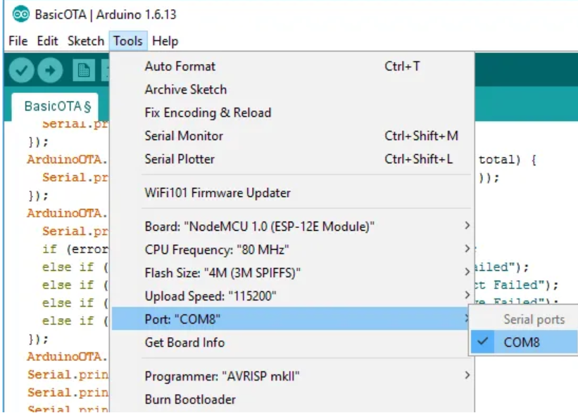

# Preparaciones

* primero que todo asegurate de tener instalado Python 2.7.12 o una version superior en tu computador. Si no lo tienes instalado, revisa [Aquí](https://www.python.org/downloads/) e instálalo
* el siguiente tutorial es una adaptacion del trabajo realizado por Santos publicado [aqui](https://randomnerdtutorials.com/esp8266-ota-updates-with-arduino-ide-over-the-air/).

# Blinking led por medio de comunicacion serial (Cable)

En este tutorial recibiras una programacion ya hecha de un Blinking LED (LED parpadeante) que será cargada por medio de un cable al ESP8266. El led utilizado viene incluido en el ESP8266 y por tanto en Wemos.

**NOTA** en caso de que estés trabajando sólo con el chip ESP8266 necesitarás un regulador de voltaje para conectarlo a tu puerto USB. El puerto USB funciona con 5V y el ESP8266 solo con 3,3V. Si lo conectas sin considerar esto tu ESP8266 se puede quemar. En mi caso personal *wemos* trae incluido un regulador de voltaje (incluido en el Chip CH340g) por lo que puedo conectarlo directamente al computador.  

1. conecta tu ESP8266 al computador por medio de un cable USB


2. Ve a **Herramientas** y selecciona el modelo de la placa (Board) que contiene tu  ESP. En este caso se trata de una Wemos D1 mini. Si tu placa no esta en el catalago selecciona "Generic ESP8266 module".
Ademas en **Herramientas** debes seleccionar el COM port. En mi caso era COM port 8, puede variar el numero no te asustes.



3. Copia el siguiente codigo en tu Arduino IDE

``` arduino
/*********
  Franco Perez
  trabajo en base a codigo de Rui Santos. 
  Description on https://randomnerdtutorials.com/esp8266-ota-updates-with-arduino-ide-over-the-air/
  
*********/

#include <ESP8266WiFi.h>
#include <ESP8266mDNS.h>
#include <WiFiUdp.h>
#include <ArduinoOTA.h>

// Replace with your network credentials
const char* ssid = "SSID";
const char* password = "Contraseña";

const int ESP_BUILTIN_LED = 2;

void setup() {
  Serial.begin(115200);
  Serial.println("Booting");
  WiFi.mode(WIFI_STA);
  WiFi.begin(ssid, password);
  while (WiFi.waitForConnectResult() != WL_CONNECTED) {
    Serial.println("Connection Failed! Rebooting...");
    delay(5000);
    ESP.restart();
  }

  // Port defaults to 8266
  // ArduinoOTA.setPort(8266);

  // Hostname defaults to esp8266-[ChipID]
  // ArduinoOTA.setHostname("myesp8266");

  // No authentication by default
  // ArduinoOTA.setPassword((const char *)"123");

  ArduinoOTA.onStart([]() {
    Serial.println("Start");
  });
  ArduinoOTA.onEnd([]() {
    Serial.println("\nEnd");
  });
  ArduinoOTA.onProgress([](unsigned int progress, unsigned int total) {
    Serial.printf("Progress: %u%%\r", (progress / (total / 100)));
  });
  ArduinoOTA.onError([](ota_error_t error) {
    Serial.printf("Error[%u]: ", error);
    if (error == OTA_AUTH_ERROR) Serial.println("Auth Failed");
    else if (error == OTA_BEGIN_ERROR) Serial.println("Begin Failed");
    else if (error == OTA_CONNECT_ERROR) Serial.println("Connect Failed");
    else if (error == OTA_RECEIVE_ERROR) Serial.println("Receive Failed");
    else if (error == OTA_END_ERROR) Serial.println("End Failed");
  });
  ArduinoOTA.begin();
  Serial.println("Ready");
  Serial.print("IP address: ");
  Serial.println(WiFi.localIP());
  pinMode(ESP_BUILTIN_LED, OUTPUT);
}

void loop() {
  ArduinoOTA.handle();
  digitalWrite(ESP_BUILTIN_LED, LOW);
  delay(1000);
  digitalWrite(ESP_BUILTIN_LED, HIGH);
  delay(1000);
}

 ```
**NOTA** debes reemplazar tu SSID y tu contraseña. El SSID no es más que el nombre de tu red. En mi caso se llama "home_eva". Por lo que mi SSD="home_eva"

4. Presiona el boton "Upload" ( la flechita al lado del ticket) en ArduinoIDE y espera a que aparezca el mensaje "Done Uploading" en el campo de color negro.


A continuación fíjate si la luz LED del ESP8266 enciende y apaga en intervalos de 1 segundo. Si es así, habrás triunfado !

5. Sin desconectar tu dispositivo dírígete a: Tools > Serial monitor o presiona Ctrl+alt+M. En la parte inferior derecha selecciona un *baud rate* de 115200. En la ventana deberá aparecer el mensaje ready y tu direccion IP, anótala y guárdala. La necesitarás luego.


Finalmente Guarda el código (ctrl+s) y cierra ArduinoIDE

Continua con **Tut3_Blinking_LED_OTA.md**


